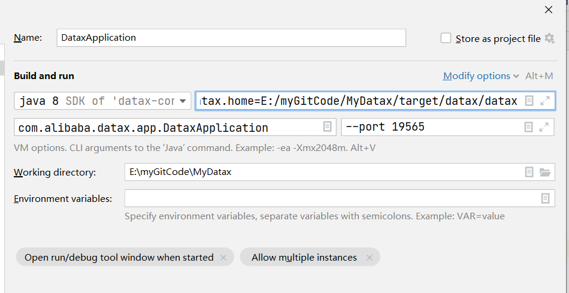
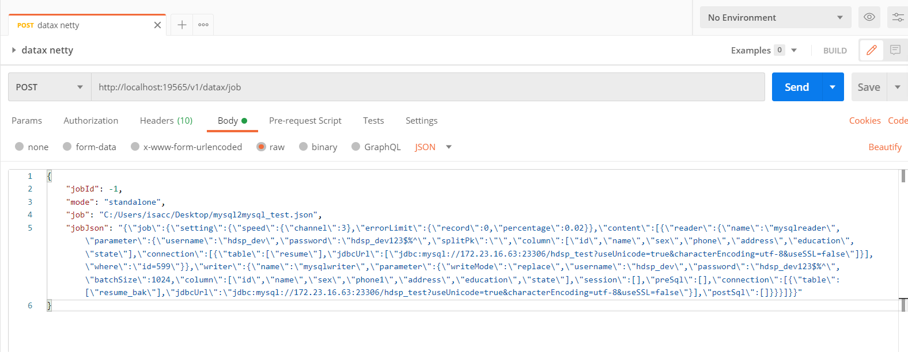

## DataX分布式集群介绍

### 1. 启动

> 准备

- datax.home环境变量必须配置
- 可指定端口启动，不指定则随机一个未使用端口启动

本地调试运行启动类```com.alibaba.datax.app.DataxApplication```即可

本地启动idea设置：



> shell方式

```
# 启动
${datax.home}/bin/datax-start.sh
# 关闭
${datax.home}/bin/datax-shutdown.sh
```

### 2. 使用示例

> 提供了一个测试接口，可用来测试连接以及负载均衡等

```
GET http://ip:port/index
```
> 提交datax任务

```
POST http://ip:port/datax/job
# body
{
    "jobId": -1,
    "mode": "standalone",
    "job": "C:/Users/isacc/Desktop/mysql2mysql_test.json",
    "jobJson": "{\"job\":{\"setting\":{\"speed\":{\"channel\":3},\"errorLimit\":{\"record\":0,\"percentage\":0.02}},\"content\":[{\"reader\":{\"name\":\"mysqlreader\",\"parameter\":{\"username\":\"hdsp_dev\",\"password\":\"hdsp_dev123$%^\",\"splitPk\":\"\",\"column\":[\"id\",\"name\",\"sex\",\"phone\",\"address\",\"education\",\"state\"],\"connection\":[{\"table\":[\"resume\"],\"jdbcUrl\":[\"jdbc:mysql://172.23.16.63:23306/hdsp_test?useUnicode=true&characterEncoding=utf-8&useSSL=false\"]}],\"where\":\"id=599\"}},\"writer\":{\"name\":\"mysqlwriter\",\"parameter\":{\"writeMode\":\"replace\",\"username\":\"hdsp_dev\",\"password\":\"hdsp_dev123$%^\",\"batchSize\":1024,\"column\":[\"id\",\"name\",\"sex\",\"phone1\",\"address\",\"education\",\"state\"],\"session\":[],\"preSql\":[],\"connection\":[{\"table\":[\"resume_bak\"],\"jdbcUrl\":\"jdbc:mysql://172.23.16.63:23306/hdsp_test?useUnicode=true&characterEncoding=utf-8&useSSL=false\"}],\"postSql\":[]}}}]}}"
}
# job是datax json配置文件路径
# jobJson是datax json配置文件内容
# 注意： jobJson优先级高，若job以及jobJson都传了的话，以jobJson为准
```
postman示例：



### 3. 引入datax-admin

- DataX分布式集群负载均衡
- 支持http方式提交DataX任务到集群运行
- 统计DataX执行信息以及本次执行脏数据

> GitHub地址
> 
> [datax-admin](https://github.com/thestyleofme/datax-admin.git)
